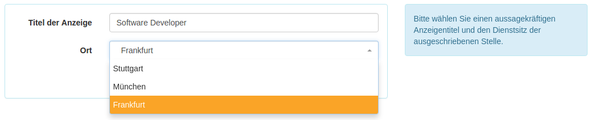
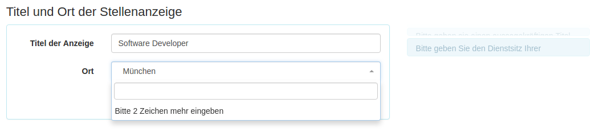
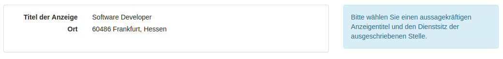

========================
FAQ: Customize Formulars
========================

Is it possible to use a certain list of locations?
--------------------------------------------------

Yes. Since 0.29 it is possible to customize forms.

The :ref:`Geo<geo>` module offers to Form Elements. ``LocationSelect``, which creates an autocomplete search fields for a location
and ``SimpleLocationSelect``, which can be used to create a select field with a certain list of locations.

Example

Company XY has branch offices in `Frankfurt`, `München` and `Stuttgart`. The HR People want to simply select one of the
location, if a job posting is created. This can be done by copying the Jobs/config/BaseFieldsetOptions.config.local.php.dist
to the `config/autoload` directory.

When using ``SimpleLocationSelect``, the form element comes with a search element. By entering a location, matching
locations are fetched from a geo service.

When using ``LocationSelect`` the form looks like. There is a fixed list of locations. You can enrich your locations
with all attributes of a Location_ entity

.. _Location: https://github.com/cross-solution/YAWIK/blob/master/module/Core/src/Entity/AbstractLocation.php
