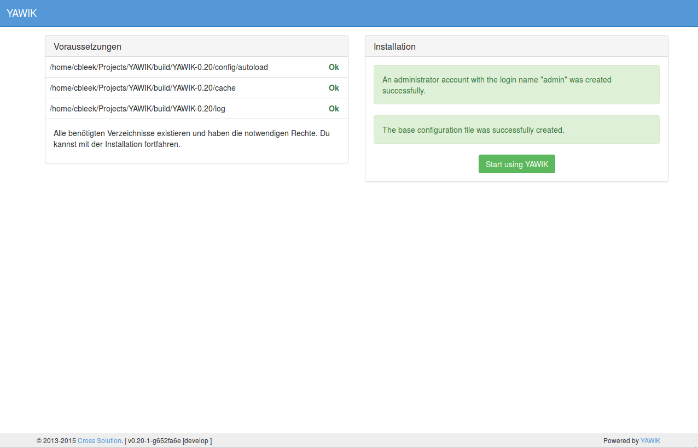
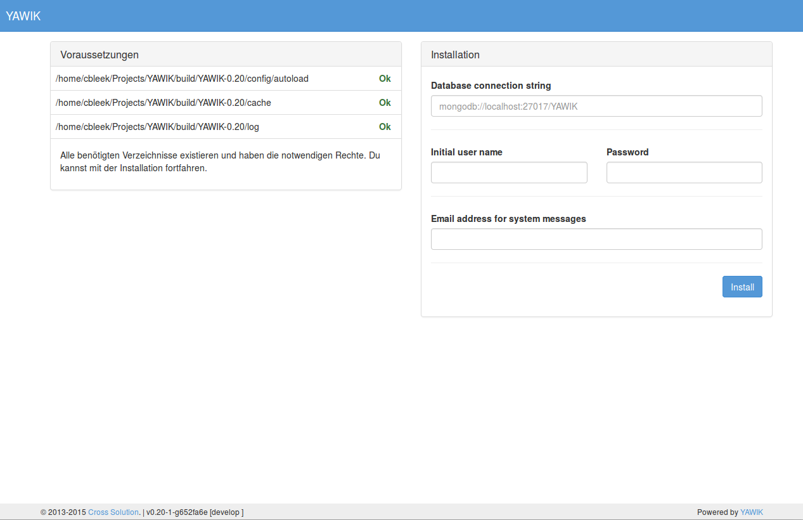

Install without composer
^^^^^^^^^^^^^^^^^^^^^^^^

Get the latest YAWIK Package from Sourceforge_. Packages are build as ZIP or TGZ archive. 
They extract into a subdirectory YAWIK-x.y.z. If you preserve the permissions, the directories
``cache`` and ``log`` should be writable after extraction.

``tar`` preserves permissions with the ``p``-Option. So unpack a TGZ with ``tar -xzpf YAWIK-y.x.z.tgz``.
``unzip`` preserves the permissions by default (at least on ubuntu 14.4). So unpack a ZIP archive with
``unzip YAWIK-x.y.z.zip``

.. _Sourceforge: https://sourceforge.net/projects/yawik/

By pointing your browser to the ``YAWIK-x.y.z/public`` directory, an installation page appears. You'll be asked to
enter a mongodb connection string, a username, a password and an email address.

.. note::

    YAWIK will run in production mode by default. So if you make modifications to the config autoload files you
    have to remove the ``cache/module-classmap-cache.module_map.php`` and ``cache/module-config-cache.production.php``.

