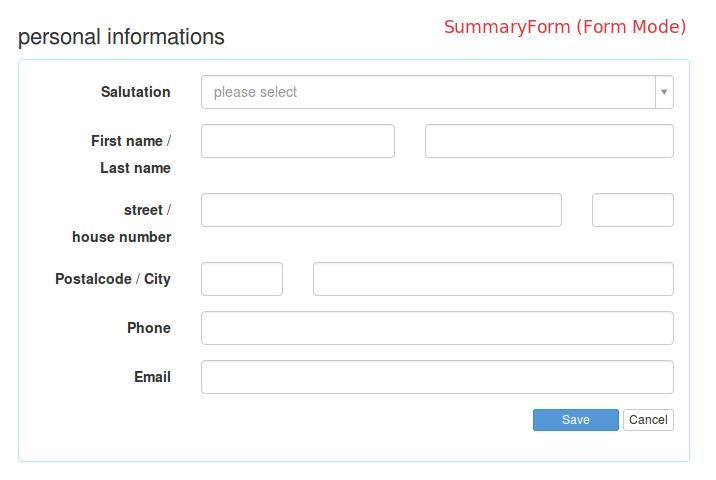
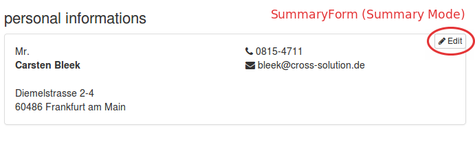

:Author: Mathias Gelhausen <gelhausen@cross-solution.de>

.. index:: Core; Forms; Forms

Learning YAWIK forms
********************

[TODO: Here must be some text....]

We try to make our forms' look and feel consistent across the application.

Therefor there are many form classes and view helpers available to help creating, handling and rendering forms.

Form
====

All YAWIK forms are handled by one javascript file, unless it has the html attribute ``data-handle`` set to a
value other than ``yk-forms``. This javascript bind on the submit event, makes a ajax call to the forms' action
and takes care of displaying the error messages, if any. It then triggers an own event called ``yk.forms.done``
and passes the ajax call result to all listeners.

BaseForm
========

Most of our forms share a common structure:

Some elements (inputs), grouped optionally in fieldsets and the "Submit" and "Cancel" buttons at the bottom.

To simplify creation of such forms, there's the  \\Core\\Form\\BaseForm class.
You specify the fieldset with the elements, and the BaseForm adds a Button-Fieldset automatically.

The specified fieldset will be used as base fieldset of the form, so binding objects to the form will effectivly
bind it to the fieldset. (see ZF-Doc_)

.. _ZF-Doc: http://framework.zend.com/manual/2.0/en/modules/zend.form.collections.html#creating-fieldsets

SummaryForm
===========

.. _form-mode:

    Form Mode

The most used form will be the SummaryForm, which is an extension of BaseForm, that lets you render a form in two
presentation modes:

- Form Mode (:ref:`form-mode`)
- Summary Mode (:ref:`summary-mode`)

.. _summary-mode:

    Summary Mode

Each presentation mode is rendered as a sub container in one html container, and one of these containers is hidden
while the other is displayed.
The summary container gets a "edit"-button in the top right corner on hovering. Clicking this button will toggle the
presentation modes.

The view helper SummaryForm takes care of rendering the form and includes the necessary Javascript files.

If the SummaryForm implements the \\Core\\Form\\ViewPartialProviderInterface, it's possible to provide a view partial
for the form and summary view separately or provide one partial to render both modes. The view helper decides what to
do on this criterions:

- To render the form part:
  It appends ``.form`` to the partial name and tries to resolve this template name using the ViewResolver.
  If this template name can be resolved, it is used to render the form, if not, the template with the original
  name is used.
- To render the summary part:
  It appends ``.view`` to the partial name and tries to resolve this template name using the ViewResolver.
  If this template name can be resolved, it is used to render the summary, if not, the template with the original
  name is used and a variable named "renderSummary" is passed with the boolean value "TRUE".

If no view partial is provided, it loops over the elements of the form and renders the elements as list of element
labels, element values pairs.

Prior to rendering, the activated mode can be set. (Either ``form`` or ``summary``)

The summary form javascript expects a field "content" in the ajax call result, which holds the rendered summary.
This content then replaces the old summary content.

Container
=========

Simple Form
===========

