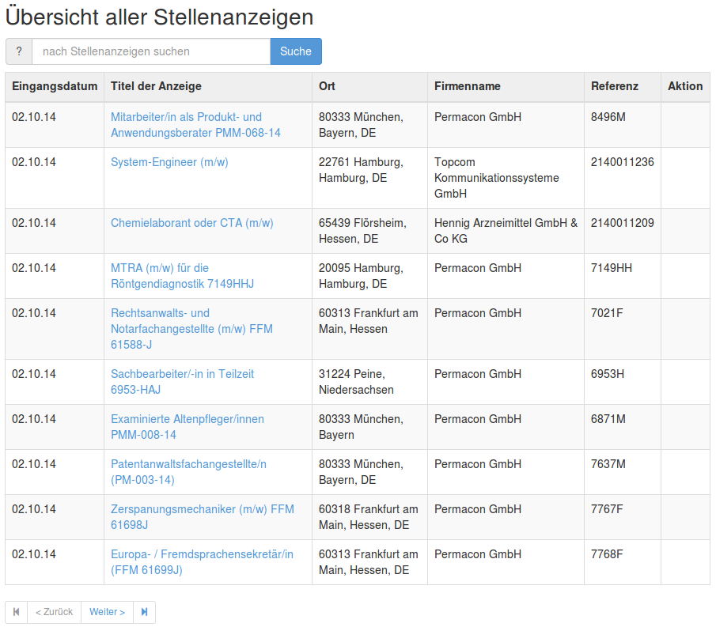

.. index:: Jobs

Jobs
----

.. raw:: html

    

    
     translation state of Jobs module.
    

The Jobs module allows to enter and manage job ads. In addition it generates a 
list of jobs. List of Jobs can be generated in a recruiter (:ref:`recruiter-mode`) 
and a public search (:ref:`search-mode`) mode

The entering process is defined at: http://www.gliffy.com/go/publish/6254781

.. _recruiter-mode:

.. figure:: ../../images/jobs_list-recruiter-mode.png
    :scale: 50%
    :align: right

    Recruiter Mode

in the recruiter mode the recruiter can see active and inactive jobs. In addition the 
list contains informations like number of applications (total/new) or the recruiters
name, who is responsible for the position.

.. _search-mode:

    Public Search Mode

in search mode the users only see published jobs. This is normally used as a list of
current vacancies, which is often used on a corporate website.

The list mode is defined by the users role.

It is also possible to configure YAWIK to run as a jobboard. There is a `jobboard
module`_ which lets YAWIK act like a jobboard. This module is running on

http://jobs.yawik.org

.. _`jobboard module`: https://github.com/cbleek/YawikDemoJobboard

Job Templates
^^^^^^^^^^^^^

you can create templates_ for entering job ads. All you need is an HTML version of your
job opening. Simply replace the `requirements`, `qualifications` or `benefits` with a small piece
of code. E.g.

.. code-block:: php

    <h4>Requirements:</h4>
    <?php echo $this->requirements;?>

YAWIK replaces this code with an inline Wysiwyg HTML Editor if you want to modify your
job opening. Otherwise the code is replaced by the HTML code, which was entered.

You currently can use the following placeholders:

+----------------------------+-------------------------------------+
| Name                       | Description                         |
+===========================+======================================+
| $this->title               | editable title of the job posting   |
+----------------------------+-------------------------------------+
| $this->titleHead           | title of the job posting            |
+----------------------------+-------------------------------------+
| $this->requirements        | requirements of the job posting     |
+----------------------------+-------------------------------------+
| $this->qualifications      | Needed qualifications               |
+----------------------------+-------------------------------------+
| $this->benefits            | Employee benefits                   |
+----------------------------+-------------------------------------+
| $this->uriLogo             | URL of a company logo               |
+----------------------------+-------------------------------------+
| $this->description         | desciption of the company           |
+----------------------------+-------------------------------------+
| $this->descriptionEditable | editable desciption of the company  |
+----------------------------+-------------------------------------+
| $this->uriApply            | URL a an application form           |
+----------------------------+-------------------------------------+
| $this->oraganizationName   | Name of the company                 |
+----------------------------+-------------------------------------+
| $this->city                | City of the company                 |
+----------------------------+-------------------------------------+
| $this->street              | Street of the company               |
+----------------------------+-------------------------------------+
| $this->postalCode          | postalCode of the company           |
+----------------------------+-------------------------------------+

.. _templates: https://github.com/cross-solution/YAWIK/blob/develop/module/Jobs/public/templates/default/index.phtml